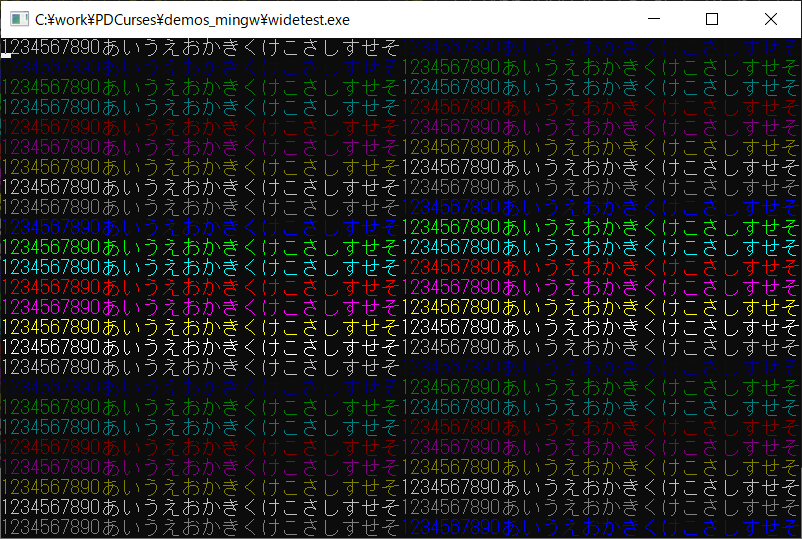

# PDCurses-win10-jp

|OK (Windows 10)|NG (Windows 10)|
|---|---|
|||

## 概要
- PDCurses の Windows Console 用ポート (wincon) を、  
  Windows 10 上での日本語表示が改善するように、改造したものです。

- (Windows 8.1 までは、非改造でも表示できていましたが、  
  Winddows 10 で、Windows Console API の互換性がなくなり、  
  日本語表示が大きく乱れるようになりました)

- オリジナルの PDCurses の情報は、以下にあります。  
  https://github.com/wmcbrine/PDCurses  
  その v3.9 (コミット 618e0aa) (2019-12-22) をベースに改造を行いました。

- 変更の差分は、以下のページで確認できます。  
  https://github.com/Hamayama/PDCurses-win10-jp/compare/pdcurses-3.9-orig-618e0aa...master


## 変更点
- オリジナルからの変更点を、以下に示します。

1. トップディレクトリに Makefile と Makefile_win8 を追加  
   MSYS2/MinGW-w64 環境で、PDCurses の Windows Console 用ポート (wincon) を、  
   ビルドするための Makefile を追加した。  
   Makefile が Windows 10 用で、Makefile_win8 が Windows 8.1 以前用になる。  
   (基本的に、Makefile_win8 を使うと、非改造のビルドになる)  
   
   そして、トップディレクトリ上で、make を実行すると、  
   0000_dist というフォルダを生成して、その中に成果物を格納するようにした。  
   (このとき、ヘッダーファイルについては、`include/pdcurses.h` を自動生成して、  
   そこから 本来のヘッダーファイルを参照するようにした。  
   (これは、MSYS2/MinGW-w64 の PDCurses パッケージの方式に合わせたものである))

2. バージョンフラグの追加  
   `( curses.h  pdcurses/initscr.c )`  
   PDC_get_version() で取得できるバージョン情報の構造体 (PDC_VERSION)  
   の flags メンバに、PDC_VFLAG_WIN10_JP ( 0x4000 ) の値を追加した。

3. 内部キャッシュの無効化  
   `( pdcurses/refresh.c )`  
   もともと、refresh (doupdate) 時は、差分だけを描画する処理になっていた。  
   しかし、文字幅の変化による更新もれが発生したため、  
   毎回、画面全体を描画するように変更した。  
   → その後、本機能は、シンボル PDC_FORCE_ALL_UPDATE を define することで、  
   有効になるようにした。  
   現状、Makefile では、Windows 10 の場合のみ、本機能を有効にしている。

4. wincon の Makefile の変更  
   `( wincon/Makefile )`  
   WIN10_JP フラグの追加等。

5. Windows Console API の変更対応  
   `( wincon/pdcwin.h  wincon/pdcdisp.c  wincon/pdcdisp_sub.c )`  
   SetConsoleCursorPosition() が、Windows 10 では、  
   文字数ではなく文字幅単位 (全角文字を 2 と数える) で、  
   X座標を指定するように変わったため、対応した。  
   (Windows 8.1 までは、( chcp 65001 の場合は) 文字数で指定するようになっていた。  
   (これは、日本語版 Windows の固有の動作だったのかもしれない。。。))  
   また、画面の幅を超えて表示しようとした場合には、  
   はみ出した部分を出力しないようにした。  
   また、ゼロ幅スペース (U+200B) については、  
   出力しないでスキップするようにした。  
   (実装の詳細については、[wincon/pdcdisp_sub.c][1] を参照)

6. 文字幅を取得するための処理を追加。  
   `( wincon/pdcwin.h  wincon/pdcscrn.c  wincon/pdcdisp_sub.c )`  
   Unicode の EastAsianWidth.txt および emoji-data.txt を元に、  
   文字幅を取得する処理を追加した。  
   (Unicode データの入手先は以下。  
   https://unicode.org/Public/UNIDATA/EastAsianWidth.txt  
   https://unicode.org/Public/UNIDATA/emoji/emoji-data.txt  
   また、データ抽出用のツールは、[tools_unicode][3] フォルダに入れておいた)  
   (ツールの実行には Gauche が必要))  
   (実装の詳細については、[wincon/pdcdisp_sub.c][1] を参照)  
   
   また、環境変数 PDC_AMBIGUOUS_WIDTH と PDC_EMOJI_WIDTH により、  
   あいまいな幅の文字 (ambiguous width character) と 絵文字の幅を指定可能にした。  
   (それぞれ 1 か 2 を指定する)  
   理論上は、表示するフォントの幅と、この環境変数の設定が一致していれば、  
   うまく表示されるはずである。  
   しかし、mintty (winpty が必要) や ConEmu では、実際に表示しているフォントとは別に、  
   裏に隠れているコマンドプロンプトのフォントの情報が内部で使用されているようで、  
   どう設定してもうまくいかなかった (カーソルの表示位置がずれたりする) 。  
   結局、これらの環境変数は、現状、設定する意味がない。

7. 画面の右端に余白を設ける機能を追加  
   `( wincon/pdcwin.h  wincon/pdcgetsc.c )`  
   シンボル PDC_RIGHT_MARGIN を define することで、  
   画面の右端に余白を設定できるようにした (0 か 1 を指定する) 。  
   これは、Windows Console API (WriteConsoleW) で画面の右端に文字を表示すると、  
   自動改行等により不具合が発生するようにみえたため、追加した。  
   (ただ、デバッグ中の勘違いだったのかもしれない。。。)  
   現状、Makefile では、Windows 10 の場合のみ、1 を指定するようにしている。

8. mintty (winpty が必要) のときは、色数を 16 色に制限する処理を追加  
   `( wincon/pdcsetsc.c )`  
   これは、winpty の制約と思われる (16 色しか表示できない)。

9. 画面のリサイズイベントの発生条件を緩和  
   `( wincon/pdckbd.c )`  
   もともと、リサイズイベントの発生後は、resize_term() を呼ぶまでは、  
   次回のリサイズイベントが発生しないようにガードされていた。  
   これを、シンボル PDC_NO_CHECK_ON_RESIZE を define することで、  
   このガードを外すことができるようにした。  
   現状、Makefile では、Windows 10 の場合のみ、本機能を有効にしている。

10. 画面リサイズ時の画面クリア  
    `( wincon/pdcscrn.c )`  
    シンボル PDC_CLEAR_ON_RESIZE を define することで、  
    resize_term() の実行時に画面をクリアできるようにした。  
    現状、Makefile では、Windows 10 の場合のみ、本機能を有効にしている。

11. リソースファイルの FileDescription を変更  
    `( common/pdcurses.rc )`  
    pdcurses.dll のファイルのプロパティで、改造版であることを確認できるようにした。

12. 初期化の追加  
    `( wincon/pdckbd.c )`  
    配列変数 ext_kptab[] の初期化に不足分があったため、追加した。  
    (static 変数の初期値は 0 なので、問題はないと思われるが、  
    コンパイル時に警告が出ていたため、追加した)  
    また、配列変数 kptab[] について、要素数 256 まで初期化するようにした。  
    (MinGW-w64 のヘッダーファイルを見ると、VK_OEM_CLEAR (0xFE) までは 定義されていたため)

13. 画面リサイズ時に、カーソルをホームポジション (0,0) に移動  
    `( wincon/pdcscrn.c )`  
    シンボル PDC_CURSOR_HOME_ON_RESIZE を define することで、  
    resize_term() の実行時に、カーソルをホームポジション (0,0) に移動するようにした。  
    これによって、画面リサイズ時に Windows Console が異常終了する現象を、回避できるもよう。  
    (参考URL：https://github.com/microsoft/terminal/issues/1976 )  
    現状、Makefile では、Windows 10 の場合のみ、本機能を有効にしている。

14. いくつかのキー入力を受け付けるように変更  
    `( wincon/pdckbd.c )`  
    シンボル PDC_ADDITIONAL_KEYS を define することで、  
    「;」「:」「,」「-」「.」「/」「@」の各キーについて、  
    Ctrl キーもしくは Alt キーとの同時押しを受け付けられるようにした。  
    (今までは、キー入力イベントが発生しなかった)  
    現状、Makefile では、Windows 10 の場合のみ、本機能を有効にしている。

15. SetConsoleMode() の処理見直し  
    `( wincon/pdcwin.h  wincon/pdcscrn.c  wincon/pdcsetsc.c  wincon/pdckbd.c )`  
    (複数の箇所で設定されており、最終的な状態がよく分からなかったため、)  
    現在の状態を、変数で管理するようにした。

16. Windows Terminal で、マウス操作に対応  
    `( wincon/pdcwin.h  wincon/pdcscrn.c  wincon/pdckbd.c  wincon/pdckbd_sub.c )`  
    シンボル PDC_VT_MOUSE_INPUT を define することで、  
    Windows Terminal の場合に、  
    VT エスケープシーケンスによるマウス入力を受け付けられるようにした。  
    (実装の詳細については、[wincon/pdckbd_sub.c][2] を参照)  
    現状、Makefile では、Windows 10 の場合のみ、本機能を有効にしている。  
    (本機能は、PDC_WIN10_JP が define されていないと、有効にならない)

17. マウスクリックイベントの無効化機能を追加  
    `( wincon/pdckbd.c )`  
    シンボル PDC_DISABLE_CLICK_EVENT を define することで、  
    マウスクリックイベントの検出を抑制できるようにした。  
    (押し下げと押し上げイベントのみになる)  
    これは、Windows Terminal で、マウスのボタンを長押しすると、  
    押し下げイベントが2回発生して、  
    マウスクリックイベントの判定を誤るケースが出たため、追加した。  
    現状、Makefile では、Windows 10 の場合のみ、本機能を有効にしている。


## インストール方法
- MSYS2/MinGW-w64 (64bit) 環境でのインストール手順を、以下に示します。  
  A または B のどちらかの方法で、インストールを実施ください。

＜A：パッケージファイルでインストールする場合＞

1. MSYS2/MinGW-w64 (64bit/32bit) 用のパッケージファイルを用意しています。  
   以下のページを参照して、インストールを実施ください。  
   https://github.com/Hamayama/PDCurses-win10-jp-package

＜B：ソースコードからビルドしてインストールする場合＞

1. MSYS2/MinGW-w64 (64bit) のインストール  
   事前に MSYS2/MinGW-w64 (64bit) がインストールされている必要があります。  
   以下のページを参考に、開発環境のインストールを実施ください。  
   https://gist.github.com/Hamayama/eb4b4824ada3ac71beee0c9bb5fa546d  
   (すでにインストール済みであれば本手順は不要です)

2. PDCurses のソースの展開  
   本サイト ( https://github.com/Hamayama/PDCurses-win10-jp ) のソースを、  
   (Download Zip ボタン等で) ダウンロードして、作業用のフォルダに展開してください。  
   例えば、作業用のフォルダを c:\work とすると、  
   c:\work\PDCurses の下にファイル一式が配置されるように展開してください。  
   (注意) 作業用フォルダのパスには、空白を入れないようにしてください。

3. PDCurses のコンパイル  
   プログラムメニューから MSYS2 の MinGW 64bit Shell を起動して、以下のコマンドを実行してください。  
   ( c:\work にソースを展開した場合)  
   ＜Windows 10 の場合＞
   ```
     cd /c/work/PDCurses
     make
   ```
   ＜Windows 8.1 以前の場合＞
   ```
     cd /c/work/PDCurses
     make -f Makefile_win8
   ```

4. PDCurses のインストール  
   コンパイルに成功すると、PDCurses フォルダ内の 0000_dist フォルダの中に、  
   bin フォルダと include フォルダと lib フォルダが生成されます。  
   
   bin フォルダの中身を、`C:\msys64\mingw64\bin` フォルダ内にコピーしてください。  
   include フォルダの中身を、`C:\msys64\mingw64\include` フォルダ内にコピーしてください。  
   lib フォルダの中身を、`C:\msys64\mingw64\lib` フォルダ内にコピーしてください。  
   
   (注意) もし、Lem エディタ ( https://github.com/cxxxr/lem ) のライブラリとして使用する場合には、  
   `C:\msys64\mingw64\include` フォルダ内の pdcurses.h をさらにコピーして、  
   ncurses.h という名前で同じフォルダ内 ( `C:\msys64\mingw64\include` ) に配置してください。  
   (この名前のヘッダーファイルしか認識しないため)

- 以上です。


## 使用例
- MinGW 用のサンプルソースを [demos_mingw][4] フォルダに格納しました。  
  widetest.c が日本語表示のサンプルで、inputtest.c がキー/マウス入力のサンプルです。  
  0000_compile.bat を実行すると、コンパイルを行い、実行ファイルが生成されます。


## その他 問題点等
1. 座標の指定について  
   現状、座標の指定については、文字単位で行うようになっている。  
   すなわち、画面左上の「`あいう`」の後ろに文字を表示したい場合には、  
   `mvaddstr(0, 3, "え");` のように指定することになる。  
   しかし、例えば Linux の ncurses では、セル単位の指定になっており、  
   `mvaddstr(0, 6, "え");` のように指定することになる。  
   この非互換性は、問題になるかもしれない。  
   (しかし、セル単位の指定にした場合、ゼロ幅の文字が連続したときに、  
   途中を指定することができないという別の問題が生じるが。。。)

2. UTF-16 のサロゲートペアの文字 (U+10000 以上) については、  
   現状、すべて全角幅扱いとしている (不完全)

3. ゼロ幅文字については、現状、ゼロ幅スペース (U+200B) のみ考慮している

4. 合字については、現状、非対応

5. ConEmu で、24bit カラーモードにすると、色付けの範囲が変になる (Windows 10)  
   (16 色モードは正常。Settings メニューの Features - Colors に選択がある)

6. ConEmu で、あいまいな幅の文字 (ambiguous width character) を表示すると、  
   カーソルの表示位置がずれる (Windows 10)  
   (表示幅が半角で、内部情報が全角になっているためと思われる)

7. mintty (winpty が必要) で、あいまいな幅の文字 (ambiguous width character)  
   を表示すると、カーソルの表示位置がずれる (Windows 10)  
   (表示幅が半角で、内部情報が全角になっているためと思われる)

8. 画面をリサイズすると、異常終了することがある  
   ~~→ リサイズ直後に変更前の範囲に文字を書き込むと発生するもよう。  
   リサイズイベントの受信後は、一定時間書き込まないようにすることで、  
   発生頻度を下げられる。しかし、完全になくすことはできなさそう。  
   (Windows Console API 側でガードすべき問題だと思うが。。。)~~  
   → 以下が原因だったもよう  
   https://github.com/microsoft/terminal/issues/1976  
   対策として、シンボル PDC_CURSOR_HOME_ON_RESIZE を define することで、  
   resize_term() の実行時に、カーソルをホームポジション (0,0) に移動するようにした。

9. ConEmu で、画面幅を半角50桁未満にすると、高確率で異常終了する  
   → 上記 8. の対策により、異常終了はしなくなったもよう。しかし、表示は乱れる。  
   (内部情報が、50桁未満にはならないのかも)

10. mintty (winpty が必要) で、画面をリサイズすると、異常終了することがある (Windows 10)  
    → これは、winpty 側で、上記 8. と同様の対策が必要であった。  
    https://github.com/Hamayama/winpty-fixes  
    の方で修正した。

11. コマンドプロンプト (cmd.exe) で、絵文字を表示できない

12. ConEmu で、絵文字を表示できない (Windows 10)

13. mintty (winpty が必要) で、絵文字を表示できない (Windows 10)

14. Windows Terminal で、マウスイベントが取れない (Windows 10)  
    現状、Windows Terminal では、Windows Console API のマウスイベント関連が、  
    未実装となっている。  
    https://github.com/microsoft/terminal/issues/376  
    ( VT エスケープシーケンスのみ、マウス入力に対応している )  
    → VT エスケープシーケンスによるマウス入力を受け付けられるようにした。

15. Windows Terminal で、Alt + 矢印キー が入力できない (Windows 10)  
    → Windows Terminal で、Pane 機能 (画面分割) 関連の操作キーとなっているため。  
    https://github.com/microsoft/terminal/issues/3729  
    Windows Terminal の設定ファイル (settings.json) 内の  
    キーバインドの設定箇所に以下を追加すると、入力可能になる。
    ```
        { "command": "unbound", "keys": [ "alt+down" ] },
        { "command": "unbound", "keys": [ "alt+left" ] },
        { "command": "unbound", "keys": [ "alt+right" ] },
        { "command": "unbound", "keys": [ "alt+up" ] },
        { "command": "unbound", "keys": [ "alt+shift+down" ] },
        { "command": "unbound", "keys": [ "alt+shift+left" ] },
        { "command": "unbound", "keys": [ "alt+shift+right" ] },
        { "command": "unbound", "keys": [ "alt+shift+up" ] },
    ```

16. その他、Windows Terminal の不具合情報 (Windows 10)
    - 日本語入力 (IME) の未確定文字列が、画面上に重なって表示される。  
      https://github.com/microsoft/terminal/issues/6192
    - 絵文字の入力が化けてエコー表示される(アプリへの入力は正常)。  
      https://github.com/microsoft/terminal/issues/1503


## 環境等
- OS
  - Windows 10 (version 1909) (64bit)
  - Windows 8.1 (64bit)
- 環境
  - MSYS2/MinGW-w64 (64bit) (gcc version 10.2.0 (Rev5, Built by MSYS2 project)) (Windows 10)
  - MSYS2/MinGW-w64 (64bit) (gcc version 9.2.0 (Rev2, Built by MSYS2 project)) (Windows 8.1)
  - winpty-fixes 0.4.4-dev ( https://github.com/Hamayama/winpty-fixes ) (Windows 10)
  - winpty 0.4.3 (Windows 8.1)
- 端末
  - コマンドプロンプト (cmd.exe)
  - ConEmu 201011 (Windows 10)
  - ConEmu 191012 (Windows 8.1)
  - mintty 3.4.1 (winpty が必要) (Windows 10)
  - mintty 3.1.4 (winpty が必要) (Windows 8.1)
  - Windows Terminal 1.4.3141.0 (Windows 10)
- ライセンス
  - オリジナルと同様とします

## 履歴
- 2020-10-1  v3.9-jp0001 Windows 10 日本語対応
- 2020-10-3  v3.9-jp0002 シンボル PDC_CLEAR_ON_RESIZE を追加
- 2020-10-11 v3.9-jp0003 環境変数名変更  
  ( PDCURSES_AMBIGUOUS_WIDTH → PDC_AMBIGUOUS_WIDTH  
  PDCURSES_EMOJI_WIDTH → PDC_EMOJI_WIDTH )  
  リソースファイル の FileDescription を変更  
  その他、内部関数の変更等
- 2020-10-12 v3.9-jp0004 コンパイル時の警告の解消。内部関数の処理一部変更
- 2020-10-13 v3.9-jp0005 内部関数の処理修正  
  (設定が全角でフォントが半角のときの対策用処理で、配列の初期化ミス)
- 2020-10-15 v3.9-jp0006 シンボル PDC_CURSOR_HOME_ON_RESIZE を追加
- 2020-10-19 v3.9-jp0007 シンボル PDC_ADDITIONAL_KEYS を追加
- 2020-10-21 v3.9-jp0008 ifdef の範囲見直し等
- 2020-10-21 v3.9-jp0009 内部処理見直し  
  シンボル名変更 ( PDC_RESIZE_NO_CHECK → PDC_NO_CHECK_ON_RESIZE )
- 2020-10-26 v3.9-jp0010 SetConsoleMode() の処理見直し
- 2020-11-1  v3.9-jp0011 Windows Terminal で、マウス操作に対応  
  マウスクリックイベントの無効化機能を追加
- 2020-11-2  v3.9-jp0012 VT エスケープシーケンスの処理を修正
- 2020-11-2  v3.9-jp0013 VT エスケープシーケンスの処理を一部見直し
- 2020-11-17 v3.9-jp0014 内部処理見直し(pdckbd_sub.c, pdcdisp_sub.c)
- 2020-11-18 v3.9-jp0015 内部処理修正(pdckbd_sub.c)
- 2020-11-23 v3.9-jp0016 内部処理見直し(pdckbd_sub.c, pdcdisp_sub.c)


(2020-11-23)


[1]:https://github.com/Hamayama/PDCurses-win10-jp/blob/master/wincon/pdcdisp_sub.c
[2]:https://github.com/Hamayama/PDCurses-win10-jp/tree/master/wincon/pdckbd_sub.c
[3]:https://github.com/Hamayama/PDCurses-win10-jp/tree/master/tools_unicode
[4]:https://github.com/Hamayama/PDCurses-win10-jp/tree/master/demos_mingw


